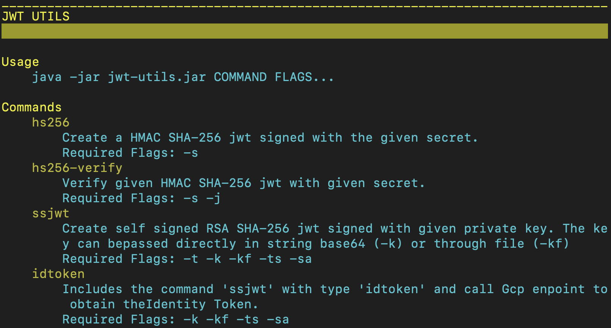
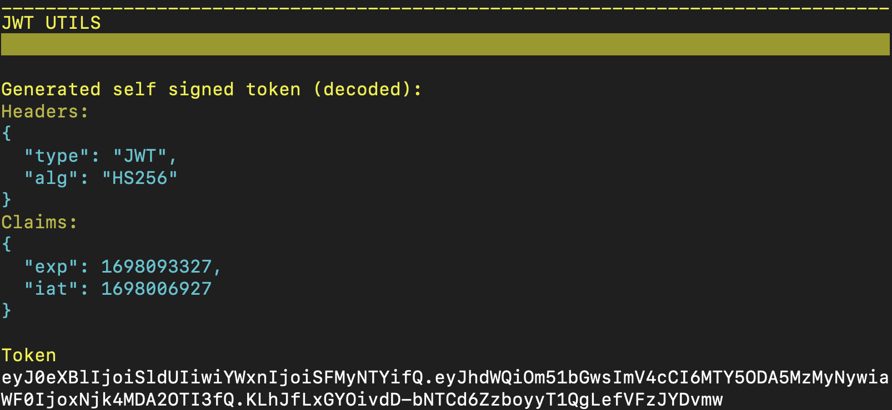

# Jwt Utils Project
## Overview
Jwt Util is an utility to create and verify self signed Json Web Tokens and also request with them an access token to an authorization server.

I've initially developer this tool for personal usage in my Google Cloud projects and to better understand JWT, Java Cryptography Architecture (JCA) and service authentication on Google Cloud.

It can be used either as dependency in an existing java project or as a tool from the command line interface.

It allows follow functionalities:
* Create and verify a self signed HS256 or RS256 Json Web Token
* Obtain an Identity Token (OpenID Connect compliant) via cloud authorization server enpoint with selft signed JWT
* Obtain an Oauth2 Access Token via cloud authorization server enpoint through self signed JWT

References to JWT standards:
* [RFC 7519 - JSON Web Token (JWT)](https://datatracker.ietf.org/doc/html/rfc7519)

Reference to Self Signed JWT on Google Cloud Platform:
* [Create short-lived credentials for a service account | IAM Documentation | Google Cloud](https://cloud.google.com/iam/docs/create-short-lived-credentials-direct#sa-credentials-jwt)
* [Using OAuth 2.0 for Server to Server Applications | Authorization | Google for Developers](https://developers.google.com/identity/protocols/oauth2/service-account)

### Algorithms
##### Message Authentication Algorithms
* HS256
##### Signature Algorithms
* RS256
### Token Request
##### Supported Cloud Provider
* Google Cloud Platform
### Java
##### Supported Java Version
* Java 11 or later
## Configuration
### Clone
Clone this repository
```
git clone https://github.com/FabioDoF/jwt-utils.git
```
### Build
###### Jar with external lib
Build with maven a Jar with dependecies on lib folder
```
cd jwt-utils
mvn -Dmaven.test.skip clean install
```
###### Fat Jar
Build a jar with all dependecies classes inside. With this archive is not need to bring /lib folder
when moving the application jar archive.
```
mvn -Dmaven.test.skip clean install -P fatjar
```

## Usage
### From Command Line
###### Help Menu
```
java -jar target/jwt-utils.jar --help
```

###### Generate an HS256 signed Jwt
```
java -jar target/jwt-utils.jar --secret <hmac-256bit-ascii-secret> -v
```

###### Generate an RS256 signed Jwt
Generate an ID Token and then use it to invoke a Google Cloud Run service endpoint.
```
java -jar jwt-utils.jar ssjwt \
  -kf private-key.pem \
  --issuer saverice-account1@myproject-id.iam.gserviceaccount.com \
  --target-audience https://project-id-jbywjzjd6a-oc.a.run.app
```
Then for example we can use it like follow:
```
curl -X POST https://project-id-jbywjzjd6a-oc.a.run.app/service-id/path \
  -H 'Authorization: Bearer <access-token>'
  ...
```
### From Java existing project
##### Dependency
Add follow dependency in pom.xml file
```
<dependency>
    <groupId>com.dof.java.jwt</groupId>
    <artifactId>jwt-utils</artifactId>
    <version>1.0.0</version>
</dependency>
```
#### In Java Code
###### Generate a RS256 signed Jwt
Generate a self signed JWT to request an Oauth2 Access Token with url https://www.googleapis.com/auth/pubsub as scope claim.
Then the obtained token is used in http Authorization header to invoke a Google Cloud Pub/Sub enpoint.
```
String accessToken = JwtTokenUtilsInit.builder().setServiceAccount(
    "service-account@project-id.iam.gserviceaccount.com")
    .setBase64PrivateKey(privateKey)
    .setScope("https://www.googleapis.com/auth/pubsub")
    .setTargetTokenType(TargetTokenType.ACCESS_TOKEN)
    .build()
    .generateSelfSignedJwt();

HttpRequest request =
    HttpRequest.newBuilder(new URI("https://pubsub.googleapis.com/ v1/projects/project-id/topics/topic-id:publish"))
      .setHeader("Authorization", "Bearer ".concat(accessToken))
      .POST(HttpRequest.BodyPublishers.ofByteArray("{\"messages\": [{\"data\": \"base64-data\"}]}")
      .build();
HttpClient client = HttpClient.newHttpClient();
HttpResponse<String> response = client.send(request, BodyHandlers.ofString());
```
## Author

**Fabio De Orazi**

* https://www.linkedin.com/in/fabio-de-orazi-a2863596
## Copyright and license

The code is released under the [Apache license](LICENSE?raw=true).

---------------------------------------

